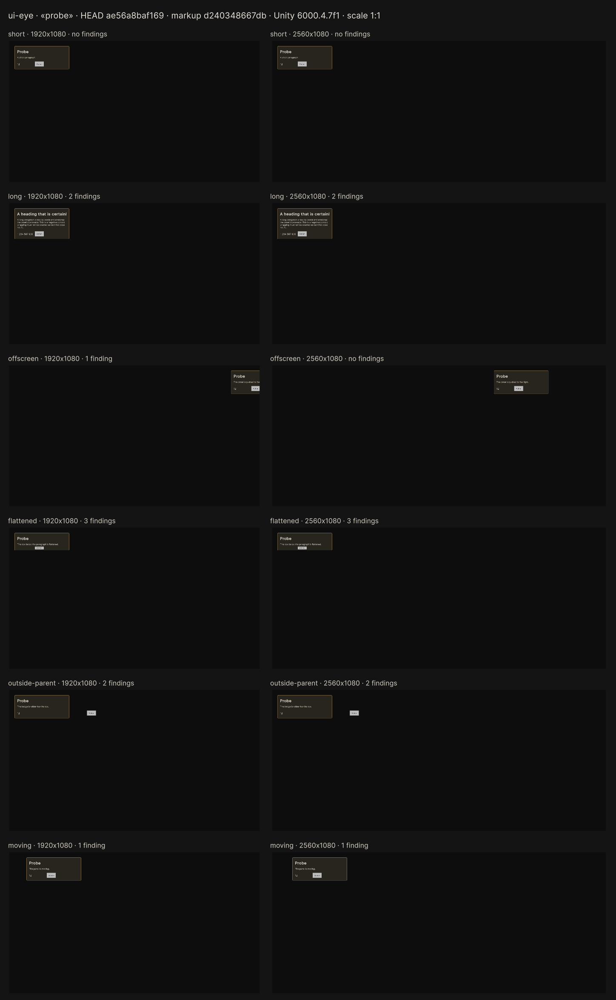

# machine-eyes

Machine eyes for Unity projects: tools that let an AI agent, or a person, see what a Unity interface actually renders
without opening the editor.

This repository holds one eye so far: **ui-eye**, a Unity package for panels built with UI Toolkit. A second
eye, for the map view, is not here yet.

Written with Claude.



*The contact sheet of `probe`, the calibration panel that ships with the package. Rows are states, columns are screen
sizes, and every thumbnail has the same scale. The label above each frame gives its number of findings.*

## What ui-eye does

One cold batch run of the Unity editor shoots one panel in every requested state and screen size. It returns:

- **a verdict in numbers**: text that does not fit its box, elements off the screen or outside their parent, named
  elements of zero size, frames that never settled;
- **frames** (PNG) and **element trees** (`.tree.txt`: type, `#name`, `.classes`, box, font, colours, visibility, text
  and the room the text needs);
- **a contact sheet** (PNG) for a person to look at;
- **a signature**: git HEAD, Unity version, graphics device, colour space, hashes of the markup and styles that were
  loaded, and which of those files are not committed.

Before it starts Unity, every shot runs a **markup ↔ code linter**. The linter checks the element names and classes that
your code looks up against the panel's UXML. Its findings stop the shot in about half a second, with file and line.

The numbers are the verdict. Whether the panel looks good is for a person to decide from the sheet.

## What it is for

ui-eye was built for long autonomous runs. An agent works on a panel — writes it, adds elements, changes the markup —
and then shoots it and reads the verdict itself. Nobody has to open the editor, take a screenshot and send it back, so
the loop closes without a person standing in it, and the run does not stop at every change.

That is why the answers look the way they do. The verdict is numbers because the agent cannot look at a picture. The
run is one cold batch because nobody is sitting at the machine. The signature says what was loaded because the agent
has to show what it measured on. The three commands are also an MCP server because that is how the agent reaches them.

The price is in the requirements below: a shot needs the Unity editor closed on the project, and takes 25–60 seconds.
For the length of an autonomous run, the editor belongs to the agent.

## Requirements

- **Windows.** Version 0.1 shoots only on Windows. On other systems the shot and the type table refuse with a message;
  the linter works everywhere.
- **Unity 6000.4**, tested on 6000.4.7f1 only. ui-eye takes the version from `ProjectSettings/ProjectVersion.txt` and
  looks for the editor where Unity Hub installs it: `C:\Program Files\Unity\Hub\Editor\<version>\Editor\Unity.exe`.
  Set `UIEYE_UNITY` to use another path.
- **Node.js 18 or newer.** No `npm install`: the tools have no dependencies.
- **The Unity editor closed** on the project while a shot runs. Otherwise the answer is code 3 and Unity is not started.
  The linter works with the editor open.

## Install

The package is `com.machine-eyes.ui-eye`, in `ui-eye/package` of this repository.

**From a clone (tested).** Clone the repository and add the package to `Packages/manifest.json` of your project:

```json
{
  "dependencies": {
    "com.machine-eyes.ui-eye": "file:<path-to-clone>/ui-eye/package"
  }
}
```

A relative `file:` path starts from the project's `Packages` folder.

**From the git URL (not tested yet).** Unity can install a package from a folder of a git repository:

```json
"com.machine-eyes.ui-eye": "https://github.com/maximivanov59540/machine-eyes.git?path=/ui-eye/package"
```

Unity then keeps the package, command-line tools included, under `Library/PackageCache`, in a folder whose name changes
when the package updates. A clone gives the tools a steady path, which matters for the MCP configuration below.

The package's assembly is `UiEye.Editor`, for the Editor platform only: nothing from it goes into a player build.

In the commands below, `<tools>` is the package's `Tools~` folder (in a clone, `<path-to-clone>/ui-eye/package/Tools~`),
and `<project>` is your Unity project folder.

## First run

Close the editor, then list the panels the project has registered:

```bash
node <tools>/ui-eye.js --list --project <project>
```

The package always registers one panel, `probe`: the calibration panel. Shoot it in its six states
at 1920x1080 and 2560x1080:

```bash
node <tools>/ui-eye.js --panel probe --project <project>
```

A run takes 25–60 seconds. The first run after a break takes about a minute and a half, most of it spent opening the
project. The report looks like this:

```text
ui-eye · «probe» · состояния: short, long, offscreen, flattened, outside-parent, moving · размеры: 1920x1080, 2560x1080
итог: НАХОДКИ — кадров 12, из них с находками 9 (код 1)
...
  long  1920x1080  находок 2 · элементов 7, проверено 7, текстовых 4 · чтений 2
      текст-не-влез  Label #title  по ширине: нужно 971, есть 375
      текст-не-влез  Label #badge  по ширине: нужно 174, есть 117
...
папка: <project>\Logs\ui-eye\<date-time>
лист: <project>\Logs\ui-eye\<date-time>\sheet.png
```

Nine frames with findings is the right answer here: the probe breaks itself on purpose (see
[Checking the tool itself](#checking-the-tool-itself)).

### Options

| Flag | English alias | Meaning |
|---|---|---|
| `--панель <name>` | `--panel` | panel name from the registry |
| `--состояния <a,b>` | `--states` | states to shoot; all by default |
| `--размеры <WxH,…>` | `--sizes` | screen sizes, 320 to 7680; `1920x1080,2560x1080` by default |
| `--линтер стоп` or `предупредить` | `--lint stop` or `warn` | linter findings stop the shot (default) or are only listed |
| `--сторож <seconds>` | `--watchdog` | limit for the whole batch from entering Play Mode; 180 by default |
| `--таймаут <seconds>` | `--timeout` | limit for the Unity process; 600 by default |
| `--папка <folder>` | `--out` | run folder instead of `<project>/Logs/ui-eye/<date-time>` |
| `--проект <folder>` | `--project` | Unity project |
| `--список` | `--list` | list the registry |

Without `--project`, ui-eye takes the `UIEYE_PROJECT` variable, and without it the nearest folder upwards from the
current one that has `ProjectSettings/ProjectVersion.txt`. A flag or variable that does not point to a project is
refused with code 5: ui-eye never falls back to a neighbouring project.

## Registering your panels

A panel is a static method without parameters that returns `UiEyePanel` and is marked `[UiEyePanel]`. Put it in an
Editor assembly of your project that references `UiEye.Editor`; the package itself is not edited.

```csharp
using UiEye;

public static class InventoryPanelEye
{
    [UiEyePanel]
    public static UiEyePanel Panel()
    {
        return new UiEyePanel(
                "inventory",
                "inventory window",
                "Assets/UI/Inventory.uxml",
                new UiEyeState(
                    "short",
                    "everything fits",
                    root =>
                    {
                        UiEyeFill.Text(root, "title", "Inventory");
                    }),
                new UiEyeState(
                    "long-title",
                    "a title that may not fit",
                    root =>
                    {
                        UiEyeFill.Text(root, "title", "Inventory of the travelling merchant from the far north");
                        UiEyeFill.AddClass(root, "list", "inventory__list--full");
                    }))
            .WithTheme("Assets/UI/Game.tss");
    }
}
```

- Markup and theme are project paths: `Assets/…` or `Packages/…`. Without `WithTheme` the panel gets ui-eye's theme,
  which is Unity's default theme. Give it your game's theme to shoot it with the game's styles.
- A state is code that receives the root of the loaded document. `UiEyeFill.Text` and `UiEyeFill.AddClass` fail loudly
  when the element is missing or has another type (code 6), instead of leaving an empty spot. A state can also drive
  your real view over fake data: then the shot shows what the game draws, not what was typed by hand.
- Call `new UiEyePanel(…)` once per panel. The linter pairs code with markup through each constructor call, which is
  why `WithTheme` returns the same object.
- Two methods with one panel name, a method of the wrong shape, one that throws or returns `null`, or no method at all:
  the registry refuses and names the place, and the shot answers code 5.

The package's own example is `Editor/Probe/UiEyeProbe.cs`.

## Reading the verdict

### Findings of a shot

| Finding | Meaning |
|---|---|
| `текст-не-влез`, text does not fit | the text needs more room than its content box: by width and height without wrapping, by height with wrapping. The numbers cannot tell clipped text from text spilling over its neighbours: look at the frame |
| `за-краем`, off the screen | a visible element goes beyond the screen; the outermost one is named |
| `за-родителя`, outside the parent | an element in the layout flow goes beyond its parent's box. Absolutely positioned elements are not checked: they do it on purpose |
| `нулевой-размер`, zero size | a named element has zero width or height |
| `не-устоялся`, not settled | the frame kept changing for 15 reads in a row: an animation or a style transition |

Only what was shot is checked. A state or a size without a shot is not "fine", it is not checked.

### Exit codes

The codes are the same for the shot and the linter, on the command line and in MCP.

| Code | Verdict | Meaning |
|---|---|---|
| 0 | ЧИСТО, clean | no findings |
| 1 | НАХОДКИ, findings | the shot worked and found something |
| 2 | НЕ СОБРАЛОСЬ, did not compile | compile errors with file and line. The batch run also compiles project assemblies that cannot be built outside Unity |
| 3 | ОТКАЗ, refused | the project is open in Unity, or another shot is running |
| 4 | СТОРОЖ, watchdog | the watchdog or the timeout fired |
| 5 | ПЛОХОЙ ЗАПРОС, bad request | unknown panel, state, size or linter mode; project not found; registry not built. The answer lists the registry |
| 6 | ПАНЕЛЬ НЕ СХОДИТСЯ, panel does not match | the markup did not load, or a state misses an element; or the linter found such a mismatch before Unity |
| 7 | СБОЙ, failure | anything else, including a linter that checked nothing |

### Run folder

`<project>/Logs/ui-eye/<date-time>/` holds `verdict.txt` (the report), `request.json`, `result.json` (the shooter's
answer), `runner.json`, `report.txt` (the shooter's log), `unity.log`, `types.json`, a `<state>_<size>.png` and a
`<state>_<size>.tree.txt` for each frame, and `sheet.png`. A shot stopped by the linter creates no folder. Unity's
standard `.gitignore` excludes `Logs/`.

Shots run one at a time on the machine: the command line, every MCP server and the calibration share one gate.

When Unity exits, it removes the project's `Temp/` folder.

## The markup ↔ code linter

```bash
node <tools>/lint.js --project <project> [--panel <name>] [--json]
```

The linter needs no Unity, takes about a second, and works with the editor open. It reads the C# under `Assets` and the
sources of the ui-eye package the project uses. It finds the names and classes the code looks up: `Q`, `Query`, and
helpers such as `UiEyeFill.Text`, which it infers from the code, so there is no list to maintain. It checks them against
the UXML of each registered panel, templates included.

Findings, with file and line:

- `нет-в-разметке`: the name is not in the markup (similar names are suggested);
- `не-тот-тип`: the element has another type;
- `имя-не-одно`: `Q` by a name that is not unique;
- `класса-нет`: the class is not in the markup and the code does not add it;
- `разметки-нет`, `разметка-не-разобрана`: no markup, or markup that could not be parsed.

What the linter could not check is listed, not hidden: `имя-вычисляется` (computed name), `не-с-чем-сверить` (a lookup
outside the registry), `тип-неизвестен` (unknown type), `путь-вычисляется` (computed path), `вызов-не-разрешён`
(unresolved call), `разбор-кода` (code not parsed). Zero checked is code 7, not clean.

The linter skips the folders Unity itself ignores — those whose names end with `~` or start with `.` — and assemblies
with `noEngineReferences: true`, which the compiler does not show UI Toolkit. It does not check USS selectors or how the
element tree changes at run time.

If the linter is wrong about a shot, `--lint warn` shoots anyway and lists its findings.

## The UI Toolkit type table

The linter knows that `Label` is a `TextElement` and a `Button` is not a `Label` from a table snapped from your own
Unity: `<project>/UserSettings/ui-eye/uitk-types.json`. Every shot refreshes it. To snap it explicitly:

```bash
node <tools>/types.js --project <project>
```

Unity's standard `.gitignore` excludes `UserSettings/`, so a fresh clone has no table. Without a table, or with a table
from another Unity version, the linter does not check types and says so loudly. After a Unity upgrade, snap it again.

## MCP server

`<tools>/mcp/index.js` is an MCP server over stdio, with no dependencies. Its tools:

- `ui_eye_shot`, with the fields `panel`, `states`, `sizes`, `frames`, `lint` and `project`. It returns the report
  and the contact sheet as an image. `frames` adds frames as images: `нет`, none (default); `с-находками`, frames with
  findings; `все`, all. At most six are attached, the rest come as paths. `lint` is `стоп` (default) or `предупредить`.
- `ui_eye_lint`, with the fields `panel` and `project`.
- `ui_eye_help`: the full usage text; with `panels: true` it also starts Unity and lists the registry.

A server runs its calls one at a time. A shot is a Unity run, so the call lasts as long as the shot.

An `.mcp.json` entry:

```json
{
  "mcpServers": {
    "ui-eye": {
      "command": "node",
      "args": ["<path-to-clone>/ui-eye/package/Tools~/mcp/index.js"],
      "env": { "UIEYE_PROJECT": "<project>" }
    }
  }
}
```

The same with Claude Code:

```bash
claude mcp add ui-eye --env UIEYE_PROJECT=<project> -- node <path-to-clone>/ui-eye/package/Tools~/mcp/index.js
```

## Checking the tool itself

The repository has a minimal Unity project for it, `ui-eye/calibration`. Each check compares the tool's answer with an
answer written down before the first run, and some checks break things on purpose: a tool that has never turned red
proves nothing.

```bash
node <path-to-clone>/ui-eye/package/Tools~/calibrate.js всё --project <path-to-clone>/ui-eye/calibration
```

`всё` ("all") runs the linter part first, then the parts that start Unity. It takes a few minutes. The expected result on
Unity 6000.4.7f1 — 129 checks right out of 129, followed by the seconds that run took, which differ from run to run:

```text
калибровка: верно 129 из 129 · 134.5 с
```

The parts can also run one by one: `линтер` (linter, no Unity), `замок` (lock), `панель` (panel), `матрица` (matrix),
`повтор` (repeat), `компиляция` (compile). On another Unity version the calibration warns that the probe's matrix may
legitimately differ. A fresh clone has no type table, so `всё` first snaps it with one more Unity run.

A red check is a question first, not a verdict on the tool: look at the frame and the tree in the run folder. Once, the
frame proved the tool right and the written answer wrong; that answer was corrected, with the reason written next to
it.

## What ui-eye does not check

- overlapping neighbours, and whether the panel looks good: look at the sheet;
- USS selectors, and how the element tree changes at run time;
- states and sizes that were not shot;
- macOS and Linux: not supported in version 0.1.

## Language

ui-eye speaks Russian: reports, findings, calibration output and some field values (`frames`, `lint`) are in Russian.
The command-line flags have English aliases; the calibration parts are Russian words.

## License

[MIT](LICENSE). Copyright (c) 2026 Maxim Ivanov.
